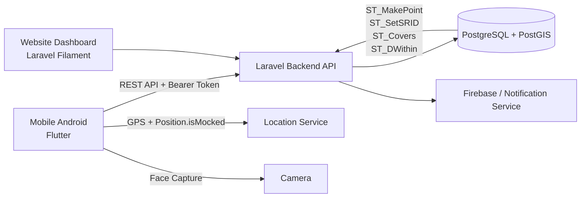

# Sistem Presensi Mobile Berbasis Geofencing Polygon

> **Tugas Akhir:** *Implementasi Sistem Presensi Mobile Menggunakan Metode Geofencing Polygon dengan Zona Toleransi Jarak (Studi Kasus: PT. Landao Machinery Indonesia)*


Repository ini merupakan implementasi sistem presensi karyawan berbasis **mobile Android** dan **website dashboard** yang dikembangkan sebagai Tugas Akhir pada Program Studi Teknik Informatika, Fakultas Ilmu Komputer, Universitas Esa Unggul.

Sistem dirancang untuk mendigitalisasi proses presensi PT. Landao Machinery Indonesia dengan memanfaatkan **Geofencing Polygon berbasis PostgreSQL/PostGIS**, **zona toleransi jarak 10 meter**, **deteksi Mock Location**, dan **Face Capture**. Selain presensi masuk dan keluar, sistem juga menyediakan pengelolaan cuti, lembur, pemantauan anggota tim, evaluasi kedisiplinan, serta rekapitulasi data melalui dashboard web.

---

## Latar Belakang

Proses presensi di PT. Landao Machinery Indonesia sebelumnya masih menggunakan mesin absensi kartu manual. Kondisi tersebut menimbulkan beberapa kendala, antara lain:

- potensi manipulasi atau titip absen;
- antrean pada mesin presensi saat jam sibuk;
- rekapitulasi data yang masih dilakukan secara manual;
- keterbatasan presensi bagi karyawan dengan mobilitas tinggi;
- tidak adanya validasi lokasi digital dan bukti visual presensi.

Untuk mengatasi permasalahan tersebut, sistem ini menerapkan validasi lokasi berbasis **Geofencing Polygon** yang mengikuti bentuk area kerja dan menambahkan toleransi jarak untuk mengakomodasi kemungkinan pergeseran koordinat GPS (*GPS drift*).

---

## Fitur Utama

### Aplikasi Mobile Android

- Login dan manajemen sesi pengguna.
- Presensi masuk dan presensi keluar.
- Pengambilan lokasi GPS secara real-time.
- Deteksi indikasi Fake GPS melalui `Position.isMocked`.
- Validasi lokasi terhadap Geofencing Polygon.
- Zona toleransi jarak maksimal 10 meter.
- Face Capture menggunakan kamera depan sebagai bukti visual presensi.
- Validasi ulang lokasi setelah pengambilan foto.
- Riwayat dan laporan presensi pengguna.
- Pengajuan izin/cuti beserta lampiran.
- Informasi lembur.
- Fitur anggota tim untuk pengguna dengan hak akses pimpinan.
- Dukungan notifikasi melalui Firebase Messaging.

### Website Dashboard

- Autentikasi Admin/HR dan Pimpinan.
- Pengelolaan pengguna dan hak akses.
- Pengelolaan data karyawan.
- Pengelolaan departemen.
- Pengelolaan zona presensi berbentuk polygon.
- Pengelolaan data presensi.
- Pengelolaan jenis dan pengajuan cuti.
- Persetujuan atau penolakan cuti.
- Pengelolaan lembur dan peserta lembur.
- Evaluasi kedisiplinan karyawan.
- Filter, monitoring, dan rekapitulasi data.
- Ekspor data presensi ke Excel.
- Activity logging untuk membantu penelusuran aktivitas sistem.

---

## Mekanisme Validasi Geofencing Polygon

Validasi lokasi utama dilakukan pada backend menggunakan fungsi spasial PostgreSQL/PostGIS, bukan melalui perhitungan algoritma geometri yang dibuat secara manual pada aplikasi.

Alur validasi secara umum:

1. Aplikasi memperoleh koordinat GPS terbaru dari perangkat.
2. Aplikasi memeriksa `Position.isMocked`.
3. Jika lokasi terindikasi sebagai Mock Location, proses presensi dihentikan.
4. Longitude dan latitude dikirim ke backend Laravel.
5. PostGIS membentuk titik menggunakan `ST_MakePoint` dan menetapkan SRID 4326 melalui `ST_SetSRID`.
6. `ST_Covers` digunakan untuk membedakan titik yang berada di dalam polygon.
7. `ST_DWithin` digunakan untuk menerima titik yang berada di dalam polygon atau masih berada maksimal **10 meter** dari geometri polygon.
8. Jika lokasi valid, pengguna dapat melakukan Face Capture.
9. Sistem mengambil kembali koordinat terbaru setelah kamera ditutup dan melakukan validasi ulang sebelum data presensi disimpan.

Status lokasi dibedakan menjadi:

- `inside_area` — titik berada di dalam area Geofencing Polygon;
- `tolerance_zone` — titik berada di luar polygon tetapi masih dalam toleransi maksimal 10 meter;
- `outside_area` — titik berada di luar area yang diperbolehkan.

---

## Arsitektur Sistem



Sistem menggunakan arsitektur **client-server**. Aplikasi Flutter bertindak sebagai client mobile, Laravel menyediakan REST API dan logika bisnis, Laravel Filament digunakan sebagai dashboard administratif, sedangkan PostgreSQL/PostGIS menangani penyimpanan dan validasi data spasial.

---

## Technology Stack

| Layer | Teknologi |
|---|---|
| Mobile App | Flutter, Dart |
| State Management | Provider |
| HTTP Client | `http` |
| Location | Geolocator |
| Map | Flutter Map, LatLong2 |
| Camera / Face Capture | Image Picker |
| Token / Local Storage | Shared Preferences, Flutter Secure Storage |
| Notification | Firebase Core, Firebase Messaging, Flutter Local Notifications |
| Backend API | Laravel 12 |
| Authentication | Laravel Sanctum |
| Admin Dashboard | Filament 4, Livewire |
| Database | PostgreSQL |
| Spatial Database | PostGIS |
| Export | Filament Excel |
| Containerization | Docker, Docker Compose |
| Web Server | Nginx |

---

## Hak Akses Pengguna

| Role | Mobile | Website Dashboard | Akses Utama |
|---|---:|---:|---|
| Staf/Karyawan | ✅ | ❌ | Presensi, Face Capture, riwayat, cuti, profil, lembur |
| Pimpinan | ✅ | ✅ | Fitur staf + pemantauan anggota tim dan fungsi manajerial |
| Admin/HR | ❌ | ✅ | Master data, zona presensi, presensi, cuti, lembur, evaluasi, laporan |

---

## Struktur Repository

```text
absensi-geo/
├── android/                # Konfigurasi platform Android Flutter
├── assets/                 # Gambar, SVG, dan aset aplikasi
├── lib/
│   ├── core/               # Utility dan helper aplikasi
│   ├── models/             # Model data Flutter
│   ├── providers/          # State management Provider
│   ├── screens/            # Halaman aplikasi mobile
│   ├── services/           # REST API, auth, presensi, cuti, lembur, notifikasi
│   ├── theme/              # Tema dan styling
│   ├── widgets/            # Reusable widgets
│   └── main.dart           # Entry point Flutter
│
├── backend/
│   ├── nginx/              # Konfigurasi Nginx
│   ├── php/                # Konfigurasi image PHP
│   ├── docker-compose.yml  # Service backend, scheduler, PostGIS, Nginx, Ngrok
│   └── src/                # Source code Laravel
│       ├── app/
│       │   ├── Filament/   # Resource dan halaman dashboard admin
│       │   ├── Http/       # Controller API
│       │   ├── Models/     # Eloquent models
│       │   ├── Policies/   # Authorization policies
│       │   └── Services/   # Service layer
│       ├── database/       # Migration, factory, dan seeder
│       ├── routes/         # API dan web routes
│       └── resources/      # Resource frontend Laravel
│
├── pubspec.yaml            # Dependency Flutter
└── README.md
```

> Folder platform Flutter lain seperti `ios/`, `web/`, `windows/`, `linux/`, dan `macos/` merupakan bagian dari struktur project Flutter. Implementasi dan pengujian Tugas Akhir difokuskan pada **Android**.

---

## Endpoint API Utama

Seluruh endpoint operasional dilindungi menggunakan Laravel Sanctum, kecuali proses login/register.

| Method | Endpoint | Fungsi |
|---|---|---|
| `POST` | `/api/login` | Login pengguna |
| `POST` | `/api/logout` | Logout pengguna |
| `GET` | `/api/me` | Mengambil profil pengguna |
| `POST` | `/api/attendance/check-in` | Presensi masuk |
| `POST` | `/api/attendance/check-out` | Presensi keluar |
| `GET` | `/api/attendance/user-zone` | Mengambil zona presensi pengguna |
| `GET` | `/api/attendance/today` | Status presensi hari ini |
| `GET` | `/api/attendance/monthly-stats` | Statistik presensi bulanan |
| `GET` | `/api/attendance/history` | Riwayat presensi |
| `GET` | `/api/attendance/report` | Laporan presensi |
| `GET` | `/api/leaves/dashboard` | Ringkasan data cuti |
| `POST` | `/api/leaves/apply` | Mengajukan cuti |
| `POST` | `/api/leaves/{id}/process` | Memproses cuti |
| `GET` | `/api/leave-types` | Daftar jenis cuti |
| `GET` | `/api/overtimes` | Daftar lembur |
| `POST` | `/api/overtimes/clock-in` | Check-in lembur |
| `POST` | `/api/overtimes/clock-out` | Check-out lembur |
| `GET` | `/api/team-members` | Daftar anggota tim |
| `GET` | `/api/team-members/{id}/attendances` | Presensi anggota tim |

---

## Instalasi dan Menjalankan Project

### 1. Clone Repository

```bash
git clone https://github.com/rassyz/absensi-geo.git
cd absensi-geo
```

### 2. Menjalankan Backend dengan Docker

Pastikan Docker dan Docker Compose telah terpasang.

```bash
cd backend
docker compose up -d --build
```

Install dependency Laravel dari container PHP:

```bash
docker compose exec absensigeo composer install
```

Siapkan environment Laravel:

```bash
cd src
cp .env.example .env
cd ..
docker compose exec absensigeo php artisan key:generate
docker compose exec absensigeo php artisan storage:link
docker compose exec absensigeo php artisan migrate
```

Sesuaikan `backend/src/.env` agar menggunakan PostgreSQL/PostGIS, misalnya:

```env
APP_NAME="Attendance Geo"
APP_ENV=local
APP_DEBUG=true
APP_TIMEZONE=Asia/Jakarta

DB_CONNECTION=pgsql
DB_HOST=absensigeo_db
DB_PORT=5432
DB_DATABASE=absensigeo
DB_USERNAME=<YOUR_DB_USER>
DB_PASSWORD=<YOUR_DB_PASSWORD>
```

> **Catatan keamanan:** jangan menyimpan password, API key, token, atau credential produksi secara langsung di repository. Gunakan `.env` yang masuk `.gitignore` dan gunakan nilai berbeda untuk development dan production.

### 3. Menjalankan Aplikasi Flutter

Kembali ke root repository:

```bash
cd ..
flutter pub get
```

Jalankan aplikasi dengan menentukan alamat backend:

```bash
flutter run --dart-define=API_BASE_URL=http://<BACKEND_HOST>/api
```

Contoh untuk backend yang sudah dapat diakses melalui HTTPS:

```bash
flutter run --dart-define=API_BASE_URL=https://your-domain.example/api
```

Pada perangkat Android fisik, pastikan alamat backend dapat diakses dari jaringan perangkat.

---

## Konfigurasi Geofencing

Nilai toleransi lokasi pada implementasi penelitian adalah **10 meter**. Nilai pada sisi mobile dan backend harus konsisten.

Backend melakukan validasi final menggunakan PostGIS, sedangkan mobile melakukan validasi lokal untuk memberikan respons UI yang lebih cepat dan mengurangi request API yang tidak diperlukan.

Konsep query spasial utama:

```sql
ST_DWithin(
    attendance_zones.area::geography,
    ST_SetSRID(ST_MakePoint(longitude, latitude), 4326)::geography,
    10
)
```

`ST_Covers` digunakan untuk membedakan titik yang benar-benar berada di dalam polygon dengan titik yang hanya berada pada zona toleransi.

---

## Hasil Pengujian Tugas Akhir

Pengujian pada penelitian meliputi Black Box Testing, validasi Geofencing Polygon, dan User Acceptance Testing.

| Pengujian | Hasil |
|---|---|
| Black Box Testing | **44 skenario berhasil** |
| Validasi Geofencing Polygon | **30 percobaan** dari 10 kondisi × 3 pengulangan |
| Kesesuaian aturan jarak | **100% sesuai skenario pengujian** |
| Rata-rata waktu respons validasi lokasi | **0,607 detik** pada perangkat dan lingkungan pengujian |
| User Acceptance Testing | **83,33% – Sangat Layak** |
| Rata-rata UAT | **4,17 / 5** |
| Responden UAT | **3 responden**: Admin/HR, Pimpinan, dan Staf |

Aturan yang diuji mencakup:

- titik berada di dalam polygon;
- titik berada tepat pada batas polygon;
- titik berada pada zona toleransi 1–10 meter;
- titik berada lebih dari 10 meter di luar polygon;
- deteksi Mock Location;
- proses Face Capture dan penyimpanan bukti presensi.

---

## Batasan Implementasi

- Implementasi dan pengujian mobile difokuskan pada perangkat Android.
- Zona toleransi 10 meter ditetapkan berdasarkan kebutuhan dan skenario pengujian pada studi kasus, sehingga bukan nilai universal untuk seluruh lokasi.
- Deteksi Fake GPS menggunakan flag `Position.isMocked` dan tidak mencakup manipulasi tingkat lanjut yang dapat menyembunyikan status Mock Location.
- Face Capture hanya digunakan sebagai bukti visual dan **bukan Face Recognition**.
- Sistem tidak mencakup modul payroll atau HRIS secara penuh.
- Pengujian dilakukan pada perangkat, kondisi jaringan, dan lokasi yang terbatas dalam lingkup penelitian.

---

## Keamanan

Beberapa praktik yang disarankan sebelum repository digunakan di luar lingkungan penelitian:

- simpan database credential pada `.env`, bukan pada `docker-compose.yml`;
- rotasi credential yang pernah tersimpan pada repository publik;
- nonaktifkan `APP_DEBUG` pada production;
- gunakan HTTPS untuk komunikasi mobile–API;
- batasi endpoint dengan authorization sesuai role;
- jangan commit Firebase private key, service-account credential, token Ngrok, atau secret lainnya;
- gunakan database user khusus dengan hak akses minimum yang diperlukan.

---

## Pengembang

**Rasyid Abdul Ra'uf**  
NIM: **20220801026**  
Program Studi: **Teknik Informatika**  
Fakultas Ilmu Komputer – **Universitas Esa Unggul**

**Dosen Pembimbing:**  
Dr. Harjo Baskoro, S.T., M.T.

---

## Tentang Repository

Repository ini dibuat untuk kebutuhan pengembangan dan dokumentasi **Tugas Akhir/Skripsi**. Implementasi di dalam repository merepresentasikan hasil penelitian sistem presensi mobile berbasis Geofencing Polygon pada studi kasus PT. Landao Machinery Indonesia.

Penggunaan data, konfigurasi, dan deployment pada lingkungan lain perlu disesuaikan kembali dengan kebijakan keamanan, kebutuhan organisasi, dan kondisi lokasi masing-masing.

---

### Kata Kunci

`Flutter` · `Laravel` · `Filament` · `PostgreSQL` · `PostGIS` · `Geofencing Polygon` · `GPS` · `Mock Location` · `Face Capture` · `Attendance System`
